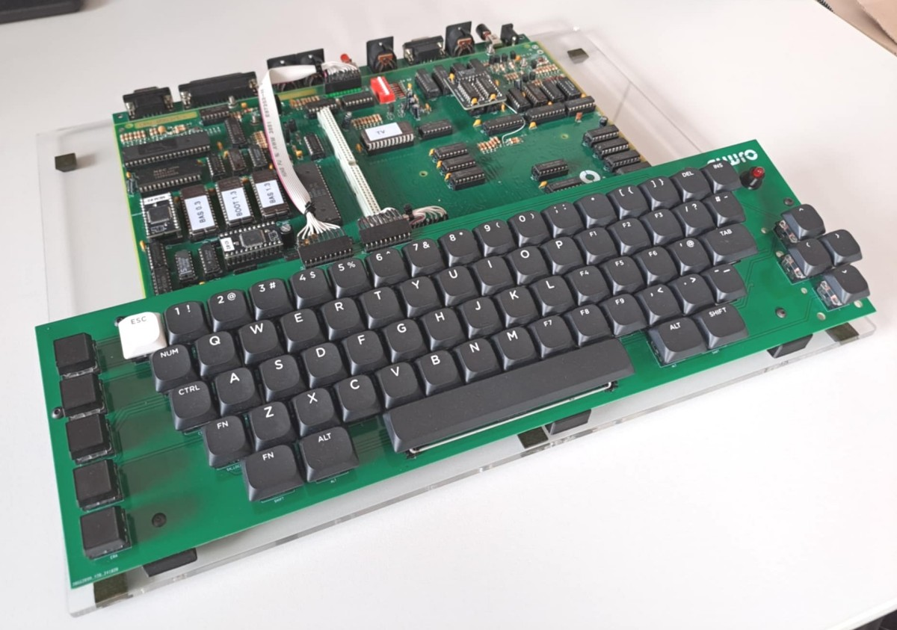

# Elwro 800 Junior replica

This repository contains all the necessary files to build a replica of [Elwro 800 Junior](https://pl.wikipedia.org/wiki/Elwro_800_Junior), a Polish home computer that can be considered a  [ZX Spectrum](https://en.wikipedia.org/wiki/ZX_Spectrum) clone. As of May 5, 2025, there are 3 successful builds, so the design files can be assumed valid.

## PCBs

The replica consists of three separate PCBs:

* [e800j_rev_c](e800j_rev_c) is the main board, an exact clone of the original *Elwro 800 Junior Rev C* PCB.  The original dimensions and mounting holes have been precisely recreated, making it suitable as a direct replacement for damaged original boards. 
* [kbd_cherry](kbd_cherry) is a replacement keyboard that uses standard Cherry MX switches. I chose not to replicate the original keyboard, as its switches are nearly impossible to source.
* [ports_pcb](ports_pcb) is a ports breakout board designed to simplify connections and avoid the mess of individual wires. This board is optional, but if you choose to connect ports with wires (as in the original design), you’ll need to derive the connections from the schematics.

All boards were designed in KiCad 9. In addition to the KiCad project files, each directory includes Gerber files, an interactive BOM, and PDF schematics. Refer to the respective subdirectories for assembly instructions and details.

### Additional documentation

* [docs/pinouts/](docs/pinouts) - pin-outs of the connectors
* [docs/scans/](docs/scans/) - scans of the original schematics and DTR (*dokumentacja techniczno-ruchowa* - Polish for *technical reference manual*)
* [docs/scart.md](docs/scart.md) - SCART cable schematics / discussion

## Side projects

* Several side projects were created alongside the main replica (hosted in separate repositories):
* [e800j_addr_dec_gal](https://github.com/codepainters/e800j_addr_dec_gal) - replacement for address decoder PROMs using `GAL16V8` (original `74S474` PROMs are hard to get)
* [e800j_addr_dec_atf](https://github.com/codepainters/e800j_addr_dec_atf) - SMT variant using `ATF1502ASL`
* [e800j_grafix](https://github.com/codepainters/e800j_grafix) - a small add-on board that fixes graphics glitches present in the original Elwro design
* [JuDIM](https://github.com/codepainters/judim) - Junior Disk Manager, a small CLI tool for transferring files to/from `DSK` images (similar in principle to [cpmtools](https://www.moria.de/~michael/cpmtools/))

More to follow.

