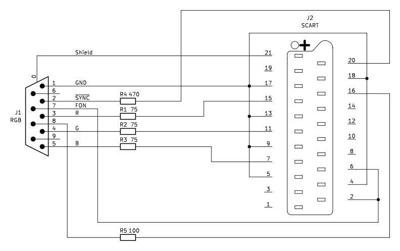
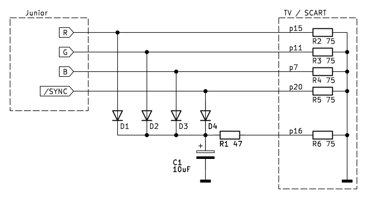
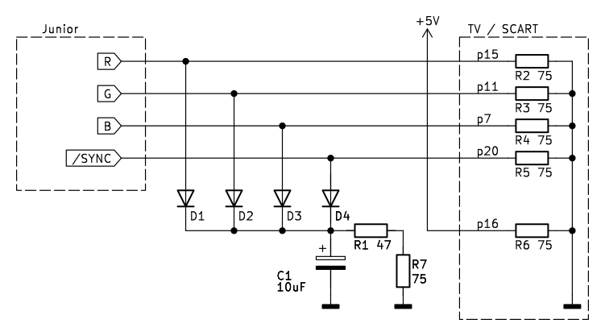

# SCART cable 

## I just want to connect my TV

Junior allows the monitor to be connected in two ways:

- via the DIN-5 connector labeled `MONITOR` (`J103` on the ports PCB, marked as `Video`) – pin 1 of this connector provides a CVBS signal, but it is monochrome only
- via the DB-9 connector labeled `RGB` (`J101` on the ports PCB), which provides digital RGB signals

The second connector allows Junior to be connected to a TV with SCART input, but a small modification is required – you need to route 5V to pin 9 of the RGB connector. For the original Junior, the easiest way is to cut the wire between the mainboard and pin 9, then connect pin 9 to any +5V point on the mainboard. If you're using my [ports_pcb](../../ports_pcb), it's enough to set the `JP2` jumper accordingly.

Next, you need to use a cable built according to this schematic:

The cable will also work without the resistors, but with them, the voltage levels at the SCART input are closer to standard, and current consumption is noticeably lower.

### But... where are my colors?

The above solution is not ideal — it only allows for displaying 8 colors, whereas Junior (like the ZX Spectrum) supports a palette of 15 colors. To correctly display all colors, the `BRIGHT` signal (pin 6 of the `RGB` connector) must also be taken into account. However, a simple resistor-based solution did not yield satisfactory results.

A similar issue applies to the Commodore 128 and CGA graphics cards. While many solutions can be found online, they won’t work correctly with the Junior due to its somewhat non-standard voltage levels (the `R`, `G`, and `B` signals only reach 2.5V). A dedicated solution for the Junior is currently in development.

## Long story

Probably the most popular monitor for Juniors nowadays is a TV with a SCART connector, usually connected using a cable made according to a schematic that was once published on his (now defunct) website by Krzysztof Komarnicki:

A cable built according to this schematic works, allowing a color image to be displayed on the TV screen:

According to the note on the schematic, this solution doesn’t work correctly with every type of TV. Based on my observations, fully correct operation is rather rare.

### Problem No. 1 – Voltage on SCART Pin 16 Too Low

It's enough to set the border color of the image to black using the `BORDER 0` command to see the first issue – clearly visible problems with horizontal synchronization in the section containing the logo, as well as a bright band and distorted text in the border area at the bottom of the screen.

To understand exactly what's happening, let's start by redrawing the schematic into a clearer form, taking into account the input impedance of the SCART connector.

Pin 16 of the SCART connector is used to switch the TV between RGB and CVBS signals; this signal is often referred to as *fast blank* (as opposed to pin 8 – *slow blank* – which switches the TV to the SCART input and selects between 4:3 or 16:9 format). According to the `BS EN 50049-1:1998` standard, a voltage above 1V selects the RGB signal.

The circuit consisting of diodes `D1` to `D4`, capacitor `C1`, and resistor `R1` is designed to generate the appropriate voltage by "stealing" current from the signal lines. However, when the image consists mainly of dark areas, the circuit fails to work properly – the voltages on the `R`, `G`, and `B` lines are close to zero, and the `/SYNC` signal level itself is too low (under a 75-ohm load it reaches only about 1.2V, which is insufficient even if a Schottky diode were used):

As a result, capacitor `C1` quickly discharges through the 75-ohm impedance of SCART pin 16, which can be confirmed by connecting the oscilloscope to pin 16:

### Problem No. 2 – Horizontal Synchronization

Let’s try, as an experiment, connecting pin 16 to an external 5V power source, and adding a 75-ohm resistor as a load to the diode-based circuit:

With this setup, the image looks significantly better, though synchronization issues are still visible in the section with the logo:

This is caused by the load imposed on the `/SYNC` signal by the circuit — after the black section of the top border, capacitor `C1` is discharged, which results in current flowing through diode `D4`. This, in turn, causes the synchronization pulse to become distorted. 

To summarize, the diode-based trick simply cannot work correctly. For this reason, I recommend supplying +5V to the `RGB` connector and using a cable built according to the schematic shown above.