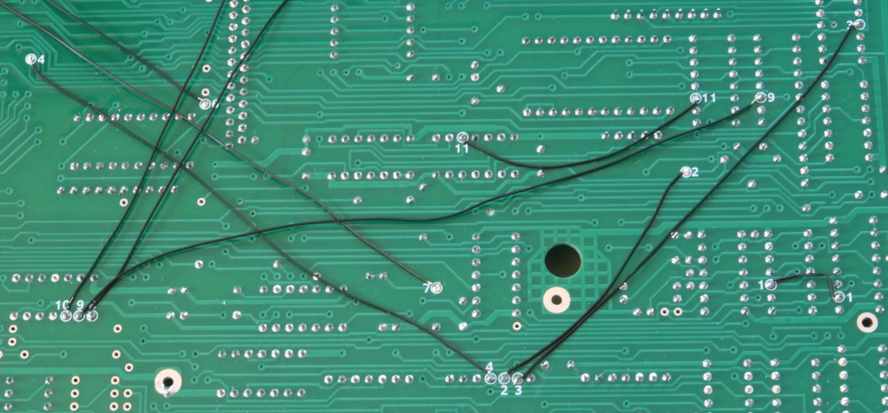

# Elwro 800 Junior replica - mainboard

This part of the project is the exact clone of the original *Elwro 800 Junior* PCB revision C. The PCB was reverse engineered from scanned images of the original PCB. All dimensions and mounting holes placements have been preserved, so the board can be used as a replacement for the original one.

Note: **Read this README file carefully**, it contains some important assembly instructions!

## Files

This directory contains the KiCAD 9 project, plus: 

* Schematics in PDF format - [color](pdfs/e800j_rev_c.pdf) and [b&w](pdfs/e800j_rev_bw.pdf) 
* [Gerber](gerbers) files (JLCPCB-compatible zip files)
* Interactive [BOM](e800j_rev_c_ibom.html) (you need to download the file and open it locally) 
* [scans](scans) of the original PCB used for reverse engineering

For files to be programmed into EPROMs, see [here](../roms).

Note: KiCAD PCB file still embeds the scanned images used for reverse engineering, so don't be surprised by the file size! The project passes PCB vs schematic parity check.

## Conventions

Schematics:

* For (hopefully) better readability, original schematic diagram has been split into separate blocks (total of 14 schematic sheets, mostly A4-size, with the exception of address decoder, DRAM, memory controller and video parts, which exceeded A4 size). I believe it's easier to analyze the schematic drawn in this manner. The PCB passes validation against schematic diagrams, so it can be assumed that the schematics are correct.
* In the top-level schematic sheet I decided to only draw some wires / buses between blocks. Global signals (like `MEMR`, or `IOR`) are only connected using labels, as the wires would clutter the drawing too much otherwise.
* Original schematics use somewhat unusual notation for signal names - prefixed with `+` or `-` sign for active-high (e.g. `+RELOK`) and active-low (e.g. `-MEMR`) signals, respectively. My schematic diagrams use standard notation with active-low signals with a bar above the name.
* Most of the signal names correspond directly to the original *Elwro* schematics, however some new signal names were added (mostly because of the cross-sheet connections). To differentiate them, upper-case names are used for signals from the original documentation, and lower-case is used for signal names introduced by me. 
* Original schematic uses "topological" reference designators for integrated circuits - the PCB is divided into numbered columns and rows marked with letters, and chip reference designators denote the chip placement, e.g. `J16`, `I5`, etc. I decided to use standard `U1, U2, ...` numbering, but original reference designators are stored as `OrigRef` attribute (also visible in the PCB editor in `User.Comments` layer). 
* Original design uses 2% `E48` series resistors for no good reason (most likely because of availability), my replica uses standard 5% `E24` series resistors. Original values are stored in the schematic as `OrigValue` attributes.
* Some IC types differ between *Elwro* documentation and the actual PCB used for reference. In such cases actual IC types as used on the board (e.g. Russian ones) are stored under `OrigType` attribute for cross-reference.

PCB:

* some connections on the board are made with pieces of wire (on top or bottom side of the PCB, the boards I used for reference has all these connections made on the top side, but I've seen original boards with wire connections made on the bottom side as well, I've chosen the bottom side for my build). In order to make the board pass schematic parity checks I have drawn these connections on `In1.Cu` and `In2.Cu` layers (typically used for 4-layer PCB projects).
* to make assembling easier the points that have to be connected are annotated with numbers on the bottom silkscreen layer, see the assembly instructions below.
* the original PCB contains some factory mods that involve cutting the traces. I decided to make the gaps on the PCB so no trace cutting is necessary (it is of course necessary to assemble other parts of the mods, see the assembly instructions).

## Assembling

### PCB variants

There are two variants of the Gerber files available:

* [e800j_rev_c_v1.1.zip](gerbers/e800j_rev_c_v1.1.zip) - a "modern" one, with tented vias and silkscreen (on both sides of the board!) - most likely what you want. The board manufactured from this set of files looks like this:

  

* [e800j_rev_c_v1.1_retro.zip](gerbers/e800j_rev_c_v1.1_retro.zip) - a "retro" variant, without via tenting and silkscreen, which aims to look as much like the original PCB as possible (which might be useful for restoration projects):

  

Unless you specifically need the retro variant, I highly recommend the standard one, with tented vias and silkscreen - it makes assembly much easier.

### Part selection

Most of the parts used on the board are standard TTL 74xx chips, with some exceptions:

*  `74S474` 512x8 PROM memories, used in the I/O and memory address decoders, are hard to find and difficult to program. As part of the project, I've prepared two replacement options:
   *  [e800j_addr_dec_gal](https://github.com/codepainters/e800j_addr_dec_gal) - using `GAL16V8` PLD

   *  [e800j_addr_dec_atf](https://github.com/codepainters/e800j_addr_dec_atf) - using `ATF1502ASL` (if you prefer SMD chips)

​		Both options have been verified to work properly.

* The `2716` EPROM (`U11` on the schematics, used to generate video signal timing) can be replaced with a `2732` memory (with the content doubled, see [roms](../roms) for the appropriate file).

* Some chips required replacement:
  * `U1`  - I had to replace a perfectly valid `74LS04` with another brand, as it didn't want to oscillate, eventually I got it working with a `UCY74LS04` from Cemi. Similarly, I had to replace the `U4` chip (`74LS04`) with `UCY74LS04` as well. These chips work in specific, semi-analog circuits, so the choice of actual chips might be important.
  * Initially, the computer was very picky about DRAM chips, only working properly with a few chips from my collection. As it turned out, replacing `U28..U31` (perfectly valid Motorola `74LS153` address multiplexers) with `SN74LS153N` from Texas Instruments solved the issue, and virtually every 4164 DRAM chip I could find works properly now.
  
* for `GT1` connector (used to plug-in floppy disk controller), you can use original Eltra 841 84-pin socket, if available. This is the recommended way if you want to use the original FDC (or a clone with an Eltra plug). Otherwise simple pin-header sockets will do (and pin headers work with Eltra 841 too. My future expansion PCBs are going to use pin headers):

  

* for keyboard connectors ( `W1` and `W2` ) one can use standard pin headers (10-pins long) - it works well with Eltra plugs. 

### PCB mods

I decided to fully replicate the original factory mods, to better match the look and feel of the PCB. 

Changes involve:

* Clock section - soldering `C83` (120pF) and `R118` (510 ohm)
* Memory controller - soldering `R119` (100 ohm)

The soldering points are marked with small dots on the silkscreen layer:

### Wire connections

Finally, 11 wire connections are needed on the bottom of the PCB. Soldering points are numbered - connect `1` to `1`, `2` to `2` and so on.

## Bring-up 

If assembled from functional parts, the board requires no tuning and should work from the first power-up.

* for initial bring-up it's best to use monochrome composite video output (pad `J51`). If you can't get properly synchronized video, double-check `U19` (`2716` EPROM responsible for generating video timing signals). Some programmers (including my TL866A) are known to be occasionally problematic with 2716 memories, what sometimes helps is programming the memory twice (without erasing). 
* `U1` and `U4` chips might need replacement (see parts section above), in case of issues it's best to check the clock signals with an oscilloscope.
* if you observe random instabilities or persistent artifacts on the screen, replace `U28..U31` (again, see above for explanation).

That's all, folks!

