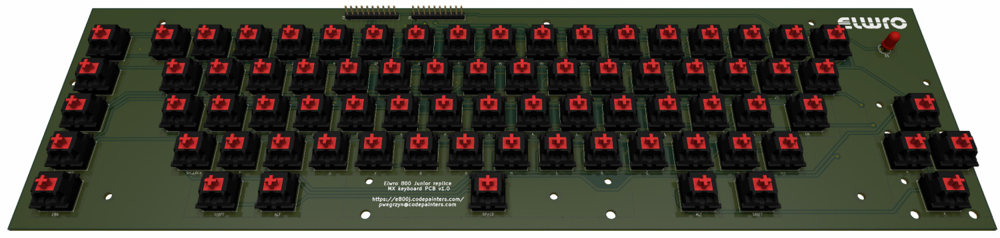

# Keyboard with Cherry MX switches

Note:

* this PCB is **not a replacement** for the original keyboard PCB. The intention here was to create a keyboard for the replica, and not for restoration work. Original switches are nearly impossible to find, so there is little point in replicating the original board anyway.
* that said, the 10-pin connectors match the original pinout, so this PCB can be connected to the original PCB, for example for testing purposes.

* https://www.keyboard-layout-editor.com/ was used to create the layout. I decided to follow the keycap widths of the original keyboard which are slightly different from a typical PC keyboard (e.g., the  `TAB` key is only `1U` wide). There are many other differences, custom keycap labels are necessary anyway, so it doesn't bother me too much. 
* the spacebar requires a typical Cherry stabilizer to work properly (the PCB-mount variant). There are stabilizer holes around the `Up` and `Down` cursor keys as well, but that’s due to the footprint used, these keys don't actually need stabilizers.

This directory contains KiCAD 9 project, plus:

* schematics in PDF format - [color](kbd_cherry.pdf) and [b&w](kbd_cherry_bw.pdf)
* [keyboard-layout.json](docs/keyboard-layout.json) file for the https://www.keyboard-layout-editor.com/
* [layout](docs/keyboard-layout.png) diagram
* relevant [scans](docs/dtr) from the original Elwro documentation
* [Gerber](gerbers) files

