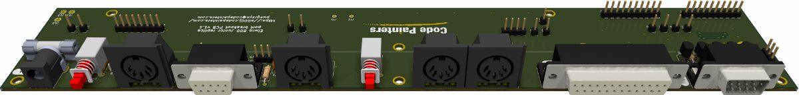
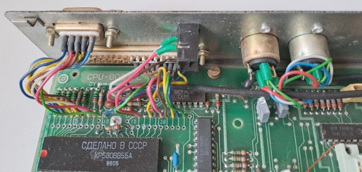
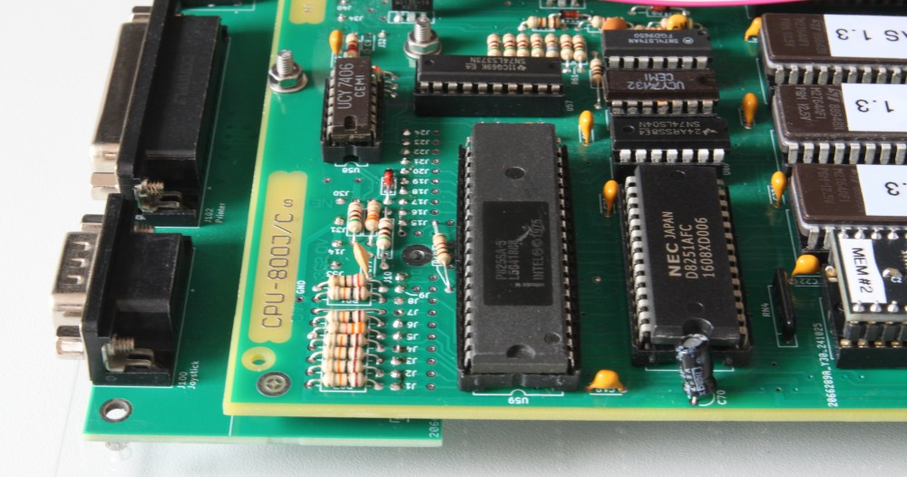
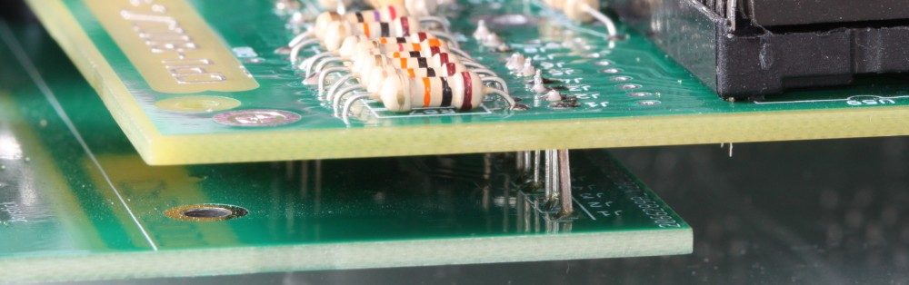
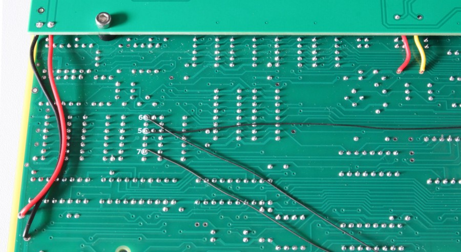

# Ports breakout PCB for the Elwro 800 Junior replica

The idea behind this board is to simplify building the Junior replica (and not only that; read the notes section below), by using PCB-mounted connectors and switches, thus avoiding all the messy wire connections, as done in the original *Elwro 800 Junior*:

## Files

This directory contains the KiCAD 9 project, plus:

* schematics in PDF format - [color](ports_pcb.pdf) and [b&w](ports_pcb_bw.pdf)
* interactive [BOM](ports_pcb_ibom.html) (you need to download the file and open it locally) 
* [Gerber](gerbers) files (JLCPCB-compatible)

## Assembly

It's best to follow the interactive [BOM](ports_pcb_ibom.html).

### Options

There are some choices to be made:

* the original *Elwro* expects the joystick to short pins 1, 2, 3, 4 and 6 to `+5V` (and not to `GND`, as is usually done). 
  Because of this, pin 8 of the joystick connector is connected to the `+5V` rail.

  I decided to add 5 simple inverters (each consisting of a PNP transistor and a resistor) to make the port more standards-compliant 
  (allowing auto-fire joysticks to work as expected). With this modification pin 8 is tied to `GND`, pin 7 delivers `+5V` (via 
   a 27-ohm resistor on the mainboard), and pins 1, 2, 3, 4 and 6 react to shorting to ground.

  * If you want to use my mod, you need to:

    * assemble `T1..T5` transistors and `R1..R5` resistors

    * short pins 1 and 2 of `JP1` 

  * If you want to be 100% compatible with the original *Junior* instead:

    * solder jumpers instead of `R1..R5` resistors

    * solder jumpers between pins 1 and 2 of `T1..T5`

    * short pins 2 and 3 of `JP1`

* if a SCART cable is used, it is necessary to pull SCART's pin 16 (aka *Fast Blank*) above 1V to switch 
  the TV set to RGB signal. Unfortunately, Junior's RGB connector doesn't include a power pin, and there 
  are no spare pins to use. 

  I decided to make pin 8 of the RGB connector configurable between `SYN_H` and `+5V`, as the `SYN_H` signal is not necessary
  for SCART operation. Similarly, `SYN_V` is not really needed, so I've added `JP3` jumper allowing for disconnecting
  pin 6 and using it for other purposes (there's a plan to use it for a second audio channel).

  So, if you want to use a SCART cable, you most likely want to:

  * assemble `C1` capacitor
  * put a jumper in place of  `R6` (the initial idea was to put a 180-ohm resistor there to limit the fast blank current, but now I think it's better to put it in the cable itself)
  * short pins 1 and 2 of `JP2`

  For a detailed explanation of the SCART issues  (as well as the cable schematics) , see [here](../docs/scart.md).

### Board stacking

The ports breakout PCB is designed to be mounted below the *Junior* main board and secured in place with M3 bolts. Corresponding pads on both the ports and main PCBs have the same labels (`J1` on the ports board should be connected to `J1` on the main board, `J2` to `J2`, etc.) and are positioned above each other (with 4 exceptions, see below), so they can be connected either by soldering short vertical wires (e.g., cut resistor pins, allowing for 5 mm spacing between the PCBs), or using "gold pin" connectors (requiring ~10 mm spacing). 

Here's how the boards look stacked together:

Close-up of the connections:

There are the following exceptions that require short insulated wire connections (`J13` can be left unconnected):

* `J41` and `J42` - for the reset button
* `J11` and `J12` - `+5V` and `GND`, respectively

Close-up of the wire connections:

## Other Notes

Note that:

* *Elwro 800 Junior* uses a `DB37` connector for the printer, while my board uses the more common `DB25`. This saves a lot of space,
  and standard PC `DB25` printer cables are much easier to find.
* the fuse socket is optional, but I suggest using a fuse - better safe than sorry.
